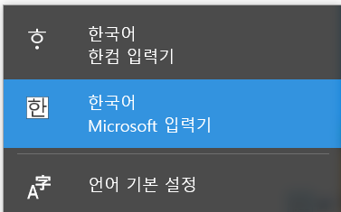

# Python 자습서 공부하기! 
by 양다영

<br>
<br>

## #22년 1월 31일#
- 자습서 보면서 새로 배운 부분 
### *name와 **name2의 뜻
* 참고 : https://stackoverflow.com/questions/3394835/use-of-args-and-kwargs , https://sshkim.tistory.com/182

1.  *name : 파라미터를 몇개를 받을지 모르는 경우 사용함. *name은 튜플 형태로 전달됨 
  ```python
def print_param(*name):
    print(name)
    for p in name:
        print(p)

  print_param('a','b','c')
    #('a','b','c')
    #a
    #b
    #c
```

2.  **name2 : 파마미터 명을 같이 보낼 수 있다. name2는 딕셔녀리 형태로 전달 
```python
def table_things(**kwargs):
     for name, value in kwargs.items():
        print( '{0} = {1}'.format(name, value))

table_things(apple = 'fruit', cabbage = 'vegetable')
#apple = fruit
#cabbage = vegetable
```

3. 자습서에서 이를 활용한 부분 

```python

def cheeseshop(kind, *arguments, **keywords):
    print("-- Do you have any", kind, "?")
    print("-- I'm sorry, we're all out of", kind)
    for arg in arguments:
        print(arg)
    print("-" * 40)
    for kw in keywords:
        print(kw, ":", keywords[kw])

cheeseshop("Limburger", "It's very runny, sir.",
           "It's really very, VERY runny, sir.",
           shopkeeper="Michael Palin",
           client="John Cleese",
           sketch="Cheese Shop Sketch")

# -- Do you have any Limburger ?
# -- I'm sorry, we're all out of Limburger
# It's very runny, sir.
# It's really very, VERY runny, sir.
# ----------------------------------------
# shopkeeper : Michael Palin
# client : John Cleese
# sketch : Cheese Shop Sketch          


```
4. 인자 목록 언 패킹에서도 사용함. 

```python
args = [3,6]
list(range(*args))
#[3, 4, 5]

#------------
def parrot(voltage, state='a stiff', action='voom'):
    print("-- This parrot wouldn't", action, end=' ')
    print("if you put", voltage, "volts through it.", end=' ')
    print("E's", state, "!")

d = {"voltage": "four million", "state": "bleedin' demised", "action": "VOOM"}
parrot(**d)
#-- This parrot wouldn't VOOM if you put four million volts through it. E's bleedin' demised !


```


## #22년 2월 2일#
- 자습서 보면서 더 찾은 부분.... 

### 올림 내림 반올림
* 참고 : https://wikidocs.net/21113

```python

#올림
import math # math 모듈 필요!!
math.ceil(-3.14) # -3
math.ceil(3.14) # 4

#내림 
import math # math 모듈 필요!!
math.floor(3.14)  # 3
math.floor(-3.14) # -4

 math.trunc(-3.14)   #결과는 -3  결과가 0으로 향함 int()와 같은 결과 반환
 math.floor(-3.14)   #결과는 -4  결과가 무조건 아래로!!

#반올림 
round(3.1415) #3
round(3.1415, 2) # 3.14  
round(31.415, -1)   #결과는 30.0

round(4.5)  #결과는 4 반올림할 자리의 수가 5이면 반올림 할 때 앞자리의 숫자가 짝수면 내림하고 홀수면 올림 한다.
round(3.5)  #결과는 4
```


### zip() 함수 

* 참고 : https://www.daleseo.com/python-zip/

1. zip()함수는... 
```python
number = [1,2,3]
letters = ["A", "B", "C"]
for pair in zip(numbers, letters):
    print(pair)

# (1, 'A')
# (2, 'B')
# (3, 'C')
```
이 코드는 다음 코드와 같은 뜻! 

```python
number = [1,2,3]
letters = ["A", "B", "C"]
for i in range(3):
    pair=(numgers[i],letters[i])
    print(pair)

# (1, 'A')
# (2, 'B')
# (3, 'C')

```

2. 병렬 처리에도 좋음 
```python
for number, upper, lower in zip("12345", "ABCDE", "abcde"):
    print(number, upper, lower)
# 1 A a
# 2 B b
# 3 C c
# 4 D d
# 5 E e

```
3. zip을 풀 수도 있음!!! 

```python
number = [1,2,3]
letters = ["A", "B", "C"]
pair = list(zip(numbers, letters))
pair 
#[(1, 'A'), (2, 'B'), (3, 'C')]


numbers, letters = zip(*pairs)
numbers 
#(1, 2, 3)
letters
#('A', 'B', 'C')
```

4. 자습서에서 활용한 부분

```python
 matrix = [[1,2,3,4],
      [5,6,7,8],
      [9,10,11,12],]

[[row[i] for row in matrix] for i in range(4)]
# [[1, 5, 9], [2, 6, 10], [3, 7, 11], [4, 8, 12]]

list(zip(*matrix))  
#[(1, 5, 9), (2, 6, 10), (3, 7, 11), (4, 8, 12)]
```

### items() 딕셔너리에서 키와 값을 동시에 얻을 수 있음 

```python
knights = {'gallahad': 'the pure', 'robin': 'the brave'}
for k, v in knights.items():
    print(k, v)
# gallahad the pure
# robin the brave
```

### 갑자기 vscode에서 단축키가 안먹을때..... 
VScode를 사용하다 보면 가끔 주석 단축키 ctrl + / 가 안될 때가 있습니다. 
이 것은 한국어입력기가 [ 한국어 한컴 입력기 ]로 설정되어 있어서 라고 한다.... ㅎ 

이렇게 설정 되어 있어야함!!! 



vscode 미리보기 ctrl + shift +v 


## #2월 4일# 

### \_\_name\_\_ 함수 이해하기

* 참고 : https://blockdmask.tistory.com/545


## 찾아본 부분
딕셔너리를 사용하여 문자열을 format() 하는 방법 
```python
a_dictionary = {"country": "England", "capital": "London"}
print("The capital of {country} is {capital}.".format(**a_dictionary))
# The capital of England is London.
```
* 참고 : https://www.kite.com/python/answers/how-to-format-a-string-using-a-dictionary-in-python


## 파일
* 파일 읽고 쓰기 
```python
f = open('workfile','w')
# r : 읽기, w: 쓰기(같은 파일 존재하는 경우 삭제됨), a : 파일 덧붙이기( 자동으로 끝에 붙음,  r+ : 파일 읽고 쓰기, 생략하면 r로 가정됨. b: 바이너리 모드 
```
텍스트 모드의 경우 상관이 없지만, JPEG파일이나 EXE 파일의 경우 줄 종료(window: \r\n unix : \n ) 변환에 문제가 있을 수 있으니 바이너리 모드를 사용할 것!! 

```python
with open('workfile') as f:
     read_data = f.read()

# We can check that the file has been automatically closed.
f.closed 
#True
```
with 을 사용하지 않으면 f.close()를 호출해서 파일을 닫아야함.

f.readline()는 파일에서 한 줄을 읽음. 

```python
for line in f:
    print(line, end = '')
```


 * 예외 처리하기 

```python
while True:
    try: #먼저 실행 예외가 없으면  except절 실행 없이 종료!
        x = int(input("Please enter a number: "))
        break
    except ValueError: 
        print("Oops!  That was no valid number.  Try again...")

```

```python 
for arg in sys.argv[1:]:
    try:
        f = open(arg, 'r')
    except OSError:
        print('cannot open', arg)
    else:
        print(arg, 'has', len(f.readlines()), 'lines')
        f.close()
```

 예외 일으키기 
```python
raise NameError('HiThere')
```

* 파일 열때 
객체 잘 정리되도록 with쓰기  !! 
```python
with open("myfile.txt") as f:
    for line in f:
        print(line, end="")
```


<br>
<br>

